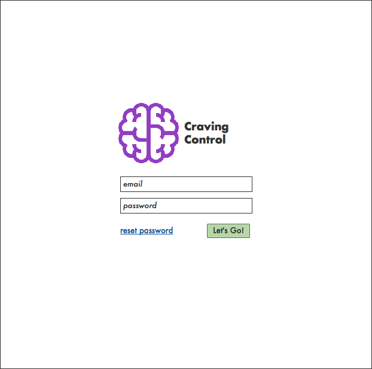
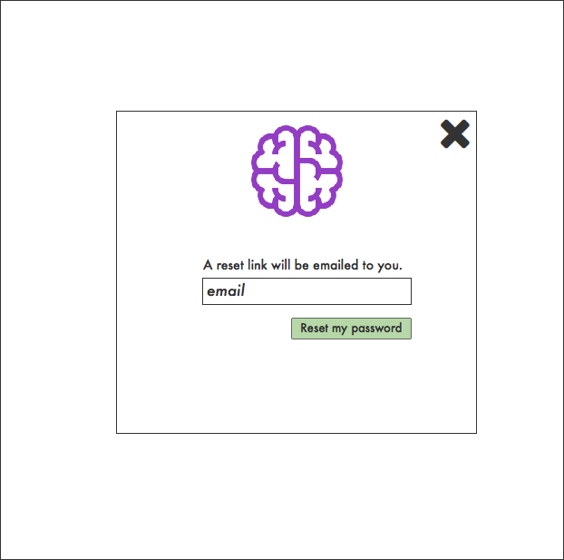
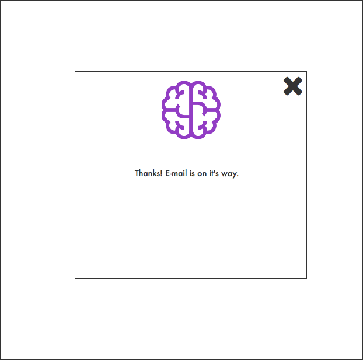
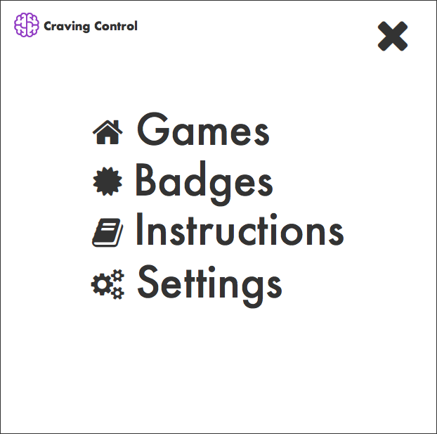
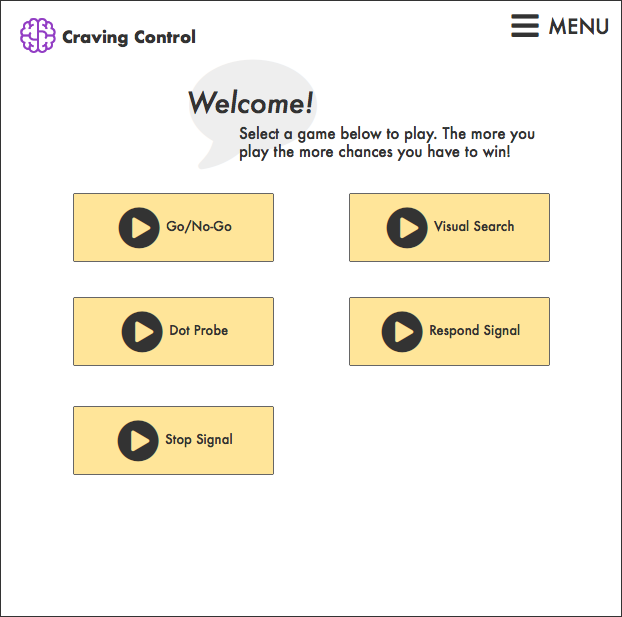
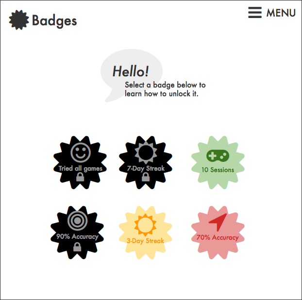
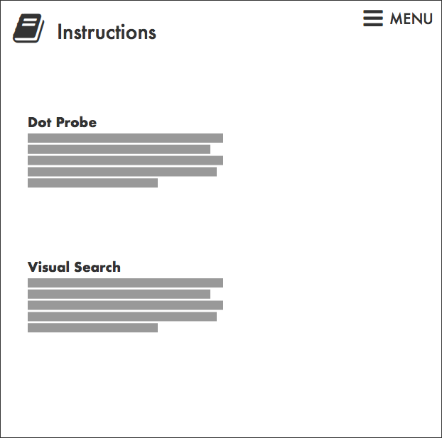
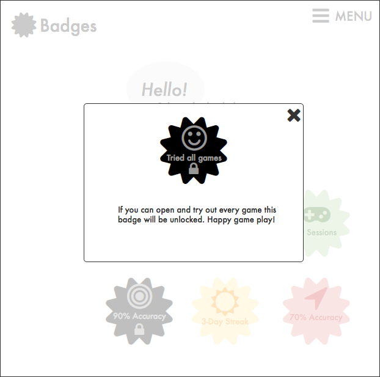
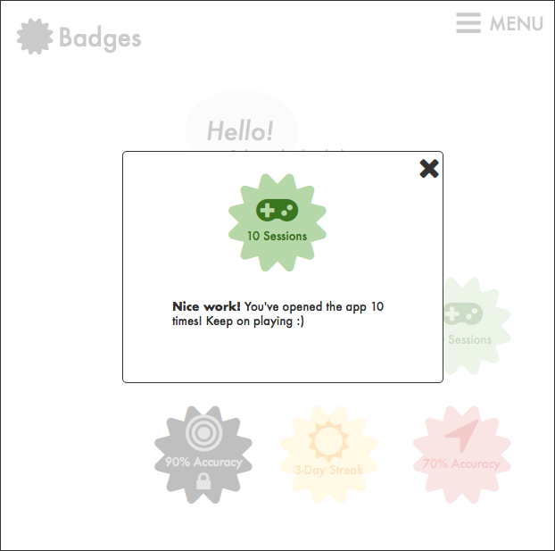
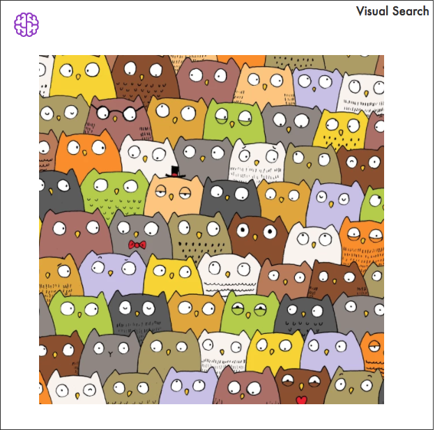

# Craving Control Frontend

## Todo

- [ ] Mockup the "Admin" frontend (the "back")
- [ ] Establish dir structure
- [ ] Establish build tool / process
- [ ] Establish routes and read Navigation.elm docs
- [ ] Create a new logo
- [ ] Select a color pallette (check color blind compatability)
- [ ] Create initial models for authentiaction
- [ ] Create login view with reset password model
- [ ] Write decoders and encoders for swagger 
- [ ] Auto generate models, encoders and decoders from swagger

## Mockups
### Login

### Menu & Pages

### Badge locking

### A game!
